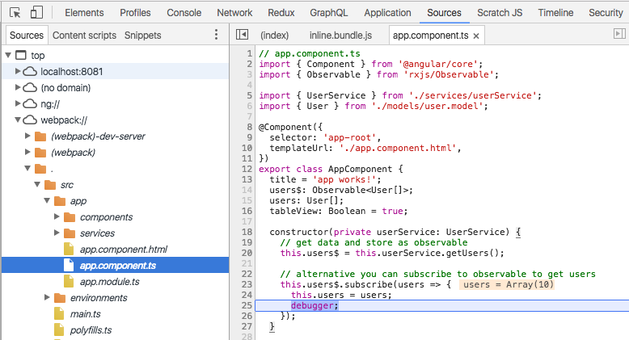
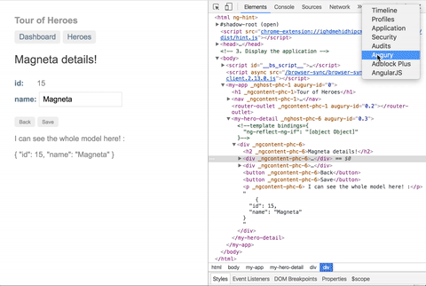

# Angular
<br>
<small>by Peter Cosemans</small>

<small>
Copyright (c) 2017 Euricom nv.
</small>

<style type="text/css">
.reveal pre code {
    display: block;
    padding: 5px;
    overflow: auto;
    max-height: 800px;
    word-wrap: normal;
}
</style>

---

# Angular CLI
> Quickly up and running

----

## Install and setup

https://github.com/angular/angular-cli

```bash
# install global
npm install @angular/cli -g

# verify version
$ ng --version

# getting help
$ ng help

# setup yarn as package manager
ng set --global packageManager=yarn
```

----

## Create Your First App

Create

```bash
ng new my-app --skip-install --skip-tests --skip-git --style=less
cd my-app
yarn
```

Startup

```
ng serve
```

Behind the scenes, the following happens:

- Angular CLI loads its configuration from .angular-cli.json
- Angular CLI runs Webpack to build and bundle all JavaScript and CSS code
- Angular CLI starts webpack dev server to preview the result on [localhost:4200](http://localhost:4200/)
- And your are up and running

----

## File structure

Simplified file structure (no tests)

```
my-app
├── angular-cli.json
├── package.json
├── src
│   ├── app
│   │   ├── app.component.css
│   │   ├── app.component.html
│   │   ├── app.component.ts
│   │   └── app.module.ts
│   ├── environments
│   │   ├── environment.prod.ts
│   │   └── environment.ts
│   ├── index.html
│   ├── main.ts
│   ├── polyfills.ts
│   ├── styles.css
│   └── tsconfig.app.json
├── .editorconfig
├── tsconfig.json
└── tslint.json
```

----

## Commands

Angular-cli provide lots of stuff

```bash
# version number
ng version
ng version --verbose

# Auto rebuild and reload on file change
ng serve
ng serve --port 8089 --open

# Build your app for production
ng build
ng build --target=development --environment=prod
ng build --prod

# Linting code
ng lint
ng lint --fix
ng lint --type-check --format=stylish

# Runs your unit tests
ng test
ng tests --watch=false

# Other
ng e2e      # Runs your e2e tests
ng xi18n    # Extract i18n texts tags
ng eject    # Use webpack & webpack-dev-server directly
```

<small>
[https://github.com/angular/angular-cli/wiki](https://github.com/angular/angular-cli/wiki)
</small>
<br>
<small>
[https://www.sitepoint.com/ultimate-angular-cli-reference/](https://www.sitepoint.com/ultimate-angular-cli-reference/)
</small>

----

## Improved npm scripts

package.json

```json
{
    "scripts": {
        "serve": "ng serve --port 8089 --open",
        "build": "ng build",
        "build:prod": "ng build --target=production --environment=prod",
        "test": "ng tests",
        "test:ci": "ng tests --watch=false && npm run lint",
        "lint": "ng lint --type-check --format=stylish"
    },
}
```

So we have the following commands:

- ```serve```: Startup and serve web app with auto watch/compile
- ```build```: Build for developement
- ```build:prod```: Build for production (minimized, aot, etc...)
- ```test```: Run unit tests and auto watch for changes
- ```test:ci```: Run unit test and linting once
- ```lint```: Run linting once

---

# The Angular App

> What makes an Angular application

- Single index.html file
- Bootstrap
- Angular Modules
- Components
- Templates

----

There is only one (simple) html file.

```html
<html>
    <head>
      <title>MyApp</title>
      <base href="/">
    </head>
    <body>
        <app-root>Loading...</app-root>
    </body>
</html>
```

> The ```script``` and ```link``` tags are injected during serve/build time

----

## Angular bootstrap

main.ts (the entry point of the app)

```ts
// main.ts
import { platformBrowserDynamic } from '@angular/platform-browser-dynamic';
import { AppModule } from './app/app.module';

// browser bootstrap
platformBrowserDynamic().bootstrapModule(AppModule);
```

----

## Angular Module

An angular module (NgModule) combines multiple JS modules into an cohesive block of related functionality.

```js
// app/app.module.ts
import { BrowserModule } from '@angular/platform-browser';
import { NgModule } from '@angular/core';

@NgModule({
    import [
        // other modules we depend on
        BrowserModule,
    ],
    declarations: [
        // all declared components, directives, pipes, ...
        AppComponent,
    ],
    providers: [
        // all services
    ],
    bootstrap: [AppComponent] // the root component
})

export class AppModule {
}
```

----

## Standard Angular Modules

- ***BrowserModule***:<br>Essential to launch and run a browser app. Imports the 'CommonModule'.
- ***CommonModule***:<br>All the basic Angular directives like NgIf, NgFor, ...
- ***FormsModule***:<br>Provide component for model driven forms.
- ***HttpModule***:<br>Data Architecture using Reactive Programming and Observables.
- ***RouterModule***:<br>Adds router directives and providers.

> Import the modules you need

----

## Component

A component contains isolated logic that controls a region of the user interface. See it as extending html itself.

```js
// app.component.ts
import { Component } from '@angular/core';
@Component({
  selector: 'app-root',
  templateUrl: './app.component.html',
  styleUrls: ['./app.component.css']
})
export class AppComponent {
  title = 'app works!';
}
```

index.html

```html
<h1>My App</h1>
<app-root></app-root>
```

> Always remember to declare component in your NgModule

----

## Templates

Templates are html snippets telling how Angular should render the component

```html
<h1>
  {{title}}
</h1>
```

----

## Templates

Template can be written as a embedded template string <br>(use back tick)

```js
@component({
    selector: 'user-profile',
    template: `
        <h1>User</h1>
        {{ user.name }}
    `
})
export class UserProfile {}
```

or as separated template file

```js
@component({
    selector: 'user-profile',
    templateUrl: './userProfile.component.html'
})
export class UserProfile {}
```

---

# Displaying data

> Power to the view

----

## Interpolation

Add some properties on the app component

    class AppComponent {
        constructor() {
            this.name = 'Peter';
            this.message = 'This is a description'
        }
    }

Now you can bind to it

```
template: `
    <div>{{message}}</div>
    <div>Hello {{name}}</div>
`
```

Use of objects

```html
<p>Employer: {{employer.companyName}}</p>
<p>Safe Employer: {{employer?.companyName}}</p>
```

And bind to attributes

```html

<a href="{{user.wikiLink}}">Wiki</a>
```

----

## One way binding (to property)

```
template: `
    ...
    <!-- Interpolation -->
    <div>Hello {{name}}</div>
    <div>{{message}}</div>

    <!-- Property Binding -->
    <div [textContent]="message"></div>
    <div [textContent]="'Some Title'"></div>
`
```

We have a binding to the textContent property of the dom element. See http://www.w3schools.com/jsref/prop_node_textcontent.asp

> Property binding is 'one way binding'

----

## One way binding - More

```html
<!-- use as a string: 'Hello Jumpy' -->
<button title="Just click the button">
<button title="Hello {{ponyName}}">

<!-- use as expression -->
<button [title]="buttonTitle">Click me</button>
<input [value]="firstName">

<!-- class property binding: https://developer.mozilla.org/en-US/docs/Web/API/HTMLElement/style -->
<span [style.color]="red">Hello from span</span>
```

Some text magic

    <input type="range" min="10" max="300" value="32" #size (input)="x" />
    <h1 [style.font-size]="size.value + 'px'">
        My text style is magically set!
    </h1>

> With Angular, your API docs for binding to DOM elements is [MDN](https://developer.mozilla.org/en-US/docs/Web/API/Element).

----

### Event Binding

A simple button click

    <!-- Event Bindig -->
    <button (click)="onClick()">Click me</button>

and the click handler

    class AppComponent {
        message: string;
        constructor() {
            this.name = 'Peter';
            this.message = 'This is a description'
        }
        onClick() {
            console.log('clicked');
        }
    }

<small>
We have a binding to the native click event of the button. <br>See http://www.w3schools.com/tags/ref_eventattributes.asp. <br>So we can use any existing (and future) event.
</small>

----

### Event Binding - More

An example with mouseOver

    <!-- html -->
    <button (mouseover)="onMouseOver()">Click me</button>

    // code
    onMouseOver() {
        console.log('mouseOver');
    }

You can get the native event

    <!-- html -->
    <button (click)="onClick($event)">Click me</button>

    // code
    class AppComponent {
        ...
        onClick(event) {
            console.log('clicked', event);
        }
    }

----

### Local Variable

    <!-- Event Binding -->
    <button (click)="onClick($event, nameInput.value)">Click me</button>

    <!-- Local variable -->
    Name: <input type="text" #nameInput/>
    Output: {{nameInput.value}}

    // code
    class AppComponent {
        ...
        onClick(event, value) {
            console.log('onClicked', event, value);
        }
    }

----

### Template Binding

`*ngIf`

```html
<section *ngIf="showSection">
```

`*ngFor`

```html
<ul>
    <li *ngFor="let contact of contacts">{{contact.name}}</li>
</ul>
```

```js
export class AppComponent {
    contacts = [
        {id: 1, name: 'peter'},
        {id: 2, name: 'wim'},
    ]
}
```

`ngSwitch`

```html
<div [ngSwitch]="conditionExpression">
  <template *ngSwitchCase="case1Exp">...</template>
  <template *ngSwitchCase="case2Exp">...</template>
  <template *ngSwitchDefault>...</template>
</div>
```

----

### Class/Style binding

```html
<!-- Binding static class with interpollation -->
<button class="btn btn-{{buttonType}">Click Me</button>

<!-- Binding an array -->
<p [ngClass]="['warning', 'big']">

<!-- Binding an object -->
<div [ngClass]="{ active: isActive, disabled: isDisabled }">

<!-- set a style directly -->
<div [ngStyle]="{ 'color': 'red' }">
```

```js
export class MyComponent {
    isActive: boolean = true,
    isDisabled: boolean = false,
}

```

---

# Exercise

> Toggle the visibility of a text on the screen by a click on a button

- Try to find multiple solutions

---

# Debugging

> If debugging is the process of removing software bugs, then programming must be the process of putting them in.

----

## Enabling and disabling debugging

Angular 2 applications have development mode enabled by default.

```
Angular 2 is running in the development mode. Call enableProdMode() to enable the production mode.
```

See main.ts

```
import { enableProdMode } from '@angular/core';
import { platformBrowserDynamic } from '@angular/platform-browser-dynamic';

import { AppModule } from './app/app.module';
import { environment } from './environments/environment';

if (environment.production) {
  enableProdMode();
}

platformBrowserDynamic().bootstrapModule(AppModule);
```

----

## JSON Pipe

The JSON pipe can help you debug by representing models as JSON objects.

```
<p> I can see the whole model here! :</p>
{{hero | json}}
```

----

## Debugger

Enabling source maps to see the TypeScript code of your application.

```json
{
    "compilerOptions": {
        "sourceMap": true,
    }
}
```

In your source code put the debugger statement

```js
constructor(service: MyService) {
    service.getCustomers()
        .subscribe(data => this.data = data);
    debugger;
}
```

Or open the sources, navigate and set break point



----

## Augury

[Angular Augury](https://augury.angular.io/)  is a great way to make the debugging process of your application more visual.



----

## Logging

While 'console.log()'' is good for debugging don't use it in production. Its better to use a logger:

```
yarn add @nsalaun/ng-logger
```

```
import { NgLoggerModule, Level } from '@nsalaun/ng-logger';
@NgModule({
    imports:      [
        BrowserModule,
        NgLoggerModule.forRoot(Level.LOG)     // change for production
    ],
    bootstrap: [ AppComponent ]
})
export class AppModule { }
```

```
@Component({})
export class MyComponent(){
    constructor(private logger: Logger){
        this.logger.log('Hello !', "It's working :)");
    }
}
```

---

# Components
> In and outs of a component

----

## Component

The minimal component

user.component.ts

```js
import { Component } from '@angular/core';
@Component({
  selector: 'user',
  template: `
    <h1>My User Component</h1>
  `,
})
export class UserComponent {
  constructor() { }
}
```

And you need to register it in the ```app.module.ts```

```js
import { UserComponent } from './user/user.component';
@NgModule({
  declarations: [
    AppComponent,
    UserComponent       // <- add your component here
  ],
  ...
})
export class AppModule { }
```

And use it

```html
<h1>User</h1>
<user></user>
```

----

## Lifecycle hooks

```js
import { Component, OnInit, OnDestroy, OnChanges } from '@angular/core';

@Component({
    ...
})
export class MyComponent implement OnInit, OnDestroy, OnChanges {
    ngOnInit() {
    }

    ngOnChange() {
    }

    ngOnDestroy() {
    }
}
```

<small>
    More see: https://angular.io/docs/ts/latest/guide/lifecycle-hooks.html
</small>

----

## Input

Getting input data from the parent: `@Input()`

```js
import { Component, OnInit, Input } from '@angular/core'

@Component({
    selector: 'user-profile',
    ...
})
export class UserProfileComponent implements OnInit {
    @Input() type: String
    @Input() user: User

    constructor() {
    }

    ngOnInit() {
        // you can access the input properties in the ngOnInit function
        console.log('type', this.type)
    }
}
```

```html
<user-profile [type]="displayType" [user]="currentUser"></user-profile>
```

----

## Input changes

// Setter function

```
@Input()
  set end(endRange: number) {
    this.endRange = endRange;
    console.log('end range is changed: ', this.endRange)
  }
```

// Lifecycle hook

```js
export class MyComponent implement OnInit, OnChanges {
    @Input('end') endRange;

    ngOnChange() {
        console.log('initial end range: ', this.endRange)
    }

    ngOnChange() {
        console.log('end range is changed: ', this.endRange)
    }
}
```

----

## Output

Sending data to parent: `@Output()`

```js
import { Component, OnInit, Input, Output, EventEmitter } from '@angular/core'

@Component({
    selector: 'user-profile',
    ...
})
export class UserProfileComponent implements OnInit {
    @Output() changed: new EventEmitter<string>();

    constructor() {
    }

    onClick() {
        this.changed.emit('myEventValue')
    }
}
```

```html
<user-profile (changed)="onUserChanged($event)"></user-profile>
```

$event === 'myEventValue'

----

## Content Projection (transclusion)

Controlling the inner content of an component

```js
import { Component, Input, Output } from '@angular/core';
@Component({
  selector: 'card',
  template: `
    <div class="card">
        <span class="card-header">{{ title }}</span>
        <div class="card-content">
            <ng-content></ng-content>
        </div>
    </div>
  `,
})
export class CardComponent {
    @Input() title: string;
    constructor() {
    }
}
```

```html
<card title="My User Card">
    <!-- put your dynamic content here -->
    <p>For example this line of text</p>
    <!-- end dynamic content -->
</card>
```

<small>
You can have [multi-slot projection](https://scotch.io/tutorials/angular-2-transclusion-using-ng-content)
</small>

----

## Parent to Child

Get a reference to a child: `@ViewChild()` or `@ViewChildren()`

```js
// userListComponent.js
@component({
    template: `
        <filter></filter>
    `
})
export class UserListComponent {
    @ViewChild(FilterComponent) filter: FilterComponent;

    getUsers() {
        this.apiService.getUsers()
            .then(users => {
                this.users = users;
                this.filter.clear();
            })
    }
}
```

```js
// filterComponent.js
export class FilterComponent {
    clear() {
        this.filter = '';
    }
}
```

<small>
You also have @ContentChild/@ContentChildren which looks for elements in your components content (the nodes projected info the component).
</small>

----

## Styling

Separated styling file (default)

```js
@Component({
  selector: 'my-zippy',
  templateUrl: './myZippy.component.html',
  styleUrls: ['./myZippy.compoment.css'],
})
export class ZippyComponent { }
```

Inline styling

```js
@Component({
  selector: 'my-zippy',
  template: `
    <h1>MyZippy</h1>
    <div class="zippy">
        <ul><li>item1</li><li>item2</li></ul>
    </div>
  `,
  styles: [`
    h1 {
        color: red;
    }
    .zippy {
      background: green;
    }
  `],
})
export class ZippyComponent { }
```

> By default all component styles are isolated and not global (you can change this)

----

## Style View Encapsulation

You can specify the view encapsulation

```js
@Component({
    ...
    encapsulation: ViewEncapsulation.Emulated  // default
})
export class MyComponent { }
```

Available View Encapsulation Types:

- ***ViewEncapsulation.None***<br>No Shadow DOM at all. Therefore, also no style encapsulation.
- ***ViewEncapsulation.Emulated***<br>Emulated Shadow DOM with style encapsulation.
- ***ViewEncapsulation.Native***<br>Native Shadow DOM with all it’s goodness. [Limit support](http://caniuse.com/#search=shadowDOM)

----

## Style View Encapsulation - Shadow DOM

To target the component itself

```css
:host {
  display: block;
  border: 1px solid black;
}
```

----

## Add external styles with Angular-cli

```bash
$ npm install bootstrap --save
```

Add config in angular-cli.json

```json
// angular-cli.json
"styles": [
    "styles.css",
    "../node_modules/bootstrap/dist/css/bootstrap.css"
],
```

Using less or sass

```json
// angular-cli.json
"styles": [
    "styles.less"
],
```

---

# Exercise
> Create dismissible bootstrap alert

- Use bootstrap styling: http://getbootstrap.com/components/#alerts-dismissible
- Create Alert component

```html
    <!-- default alert: warning -->
    <alert>
        Almost out of stock
    </alert>

    <!-- info alert -->
    <alert type="info">
        You can order online.
    </alert>

    <!-- error alert with close button -->
    <alert type="error" (closed)="onClosed()">
        <strong>Alert!</strong> We have a problem.
    </alert>
```

- Don't use jquery or the bootstrap js library
- Log a message to the console if the Alert is closed

---

# Services

> A place for common logic.

Keep so little logic in your components as possible, use services to handle the business logic.

----

## Services

A simple service

```js
import { Injectable } from '@angular/core'

@Injectable()
export class UserService {
    getUsers() {
        return [
            { id: 1, name: 'john', role: 'admin'}
            { id: 1, name: 'peter', role: 'guest'}
        ]
    }
}

```

And use it (with Dependency Injection)

```js
...
import { UserService } from './services/userService'
...
export class UserListComponent implements OnInit {
    users = [];
    // the userService is injected by the Angular Dependency Injection
    constructor(private userService: UserService) {
    }

    ngOnInit() {
        this.users = this.userService.getUser();
    }
}

```

----

## Service registration

You need to register the service in your NgModule

```js
import { UserService } from './services/userService'
...

@NgModule({
    declarations: [
        ...
    ],
    providers: [
        UserService,
    ],
})
```

----

## Angular Services

You can use services in services, like the Angular http service

```js
import { Injectable } from '@angular/core'
import { Http } from '@angular/http'

@Injectable()
export class UserService {
    constructor(private http: Http) {
    }
    getUsers() {
        return this.http.get('/api/users')
            .map((res: Response) => res.json().data)
    }
}

```

---

# Resources

- [ngx-pipes](https://github.com/danrevah/ngx-pipes)
