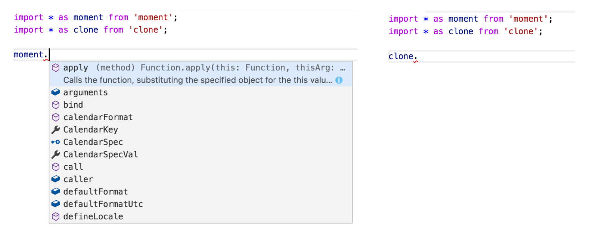

# Javascript Refresher
<br>
<small>by Peter Cosemans</small>

<small>
Copyright (c) 2017 Euricom nv.
</small>

<style type="text/css">
.reveal pre code {
    display: block;
    padding: 5px;
    overflow: auto;
    max-height: 800px;
    word-wrap: normal;
}
</style>

---

# Learn Javascript

<br>

> https://github.com/getify/You-Dont-Know-JS

---

# ES5, ES6, ES2016, ES.Next, TypeScript

> What's going on with JavaScript versioning

----

## Terms of terminology

- ECMAScript
- ECMAScript 5 (ES5) - 2009
- ECMAScript 6 (ES6/ES2015) - 2015
- ECMAScript 2016 (ES7) - 2016
- ECMAScript 2017 - 2017
- ES.Next
- TC39

Note:
- ECMAScript: A language standardized by ECMA International.
- JavaScript: The commonly used name for implementations of the ECMAScript standard
- ECMAScript 5 (ES5): The 5th edition of ECMAScript, standardized in 2009
- ECMAScript 6 (ES6/ES2015): The 6th edition of ECMAScript, standardized in 2015.
- ECMAScript 2016: The 7th edition of ECMAScript

----

## What about TypeScript

> It's just ECMAScript 6+ and typings

https://github.com/Microsoft/TypeScript/wiki/Roadmap

----

## ES6+ Today

<br>

- Edge, Chrome, Firefox and Safari: +95%
- Node 7.x: +98%

> [http://kangax.github.io/compat-table/es6/](http://kangax.github.io/compat-table/es6/)

---

# NodeJS (quick start)

> Your Javascript engine for the desktop

----

## NodeJS - Which version - LTS or Current


> [http://node.green/](http://node.green/)

----

## NodeJS - Run your code

Your JS file

    // main.js
    console.log('Hello nodeJS')

To run

    $ node main
    Hello nodeJS

----

## NodeJS != Browser

Node doesn't have:

```
    + window object
    + location object
    + document object
```

But has:

```
    + global object (== window object)
    + console object
    + setInterval & setTimeout function
```

----

## Node Package Manager (NPM)

> The JavaScript way of packaging and deploying code (modules)

```bash
# versions
$ node --version      # node version
$ npm --version       # npm version

# to create a package.json (definition of all packages in this project)
$ npm init

# to install a module
$ npm install jquery --save

# to install a module globally
$ npm install typescript -g

# to install all modules defined in the package.json
$ npm install

# to remove a module
$ npm uninstall jquery --save
```

Yarn (fast, reliable and secure) alternative to npm

```bash
$ yarn add jquery               # install jquery
$ yarn                          # install all modules from package.json
$ yarn remove jquery            # uninstall jquery
```

----

## Npm/Yarn other usefull commands

```bash
# NPM
npm list --depth=0 -g           # list global install packages
npm list --depth=0              # list local install packages
npm cache clean                 # clear cache
npm config list                 # show configs

# YARN
$ yarn info jquery              # show information about package
$ yarn add jquery@2.2.4         # install jquery v2.2.4
$ yarn outdated                 # show which packages are outdated
$ yarn upgrade-interactive      # interactive upgrade all modules
```

----

## Npm scripts

You can run small CLI script via npm/yarn

```json
{
    "name": "temp",
    "version": "1.0.0",
    "scripts": {
        "serve": "node main.js"
    },
    ...
}
```

To run

```bash
$ yarn serve            # or 'npm run serve'
yarn serve v0.18.1
$ node main.js
✨  Done in 0.12s.
```

> Typically everything is started this way: <br>build, serve, test, lint, ...

---

# Typescript (Quick Start)
<br>

> Install & Startup

https://github.com/Microsoft/TypeScript/wiki/Roadmap#23-may-2017

----

## Typescript in NodeJS

Install

```bash
$ npm install typescript -g
```

Configure

``` bash
$ tsc --init          -> creates the tsconfig.json
```

```json
// https://www.typescriptlang.org/docs/handbook/compiler-options.html
{
    "compilerOptions": {
        "module": "commonjs",
        "target": "es5",
        "strict": false,
        "noImplicitAny": false,
    },
    "exclude": [
       "node_modules"
    ]
}
```

main.ts

```ts
const message = 'hello world'
console.log(message);
```

Compile

```bash
$ tsc main.ts        # creates the main.js file
```

----

## Run typescript without compile

Install

```bash
# install ts-node
$ npm install ts-node -g
```

Run it

```bash
ts-node main.ts
```

Relaunch on code change

```bash
$ npm install nodemon -g
$ nodemon --exec ./node_modules/.bin/ts-node -- ./main.ts
```

Add as npm script

```json
{
    "name": "temp",
    "version": "1.0.0",
    "scripts": {
        "serve": "nodemon --exec ./node_modules/.bin/ts-node -- ./main.ts"
    },
    ...
}
```

> Don't use ts-node in production

----

## Linting your code

Install tslint (https://palantir.github.io/tslint/)

```bash
$ yarn add tslint@4.5.x --dev
$ yarn add tslint-config-shopify --dev

# or
$ yarn add tslint@4.5.x tslint-config-shopify --dev
```

Config: tslint.json

```json
// tslint.json
{
    "extends": "tslint-config-shopify",
    "rules": {
        "no-console": [false, "log", "error"]
    }
}
```

Add npm script

```json
"scripts": {
    ...
    "lint": "tslint --project tsconfig.json --type-check"
}
```

Other tslint configs

- https://github.com/blakeembrey/tslint-config-standard

Angular tslint configs

- http://codelyzer.com/
- https://github.com/valor-software/tslint-config-valorsoft

----

## ts-node template

```
<git-root>\template\ts-node
```

Template ready to:

- Run any typescript code in nodeJS
- Editorconfig for consistent tabs/spacing
- TSLint typescript with [shopify styleguide](https://github.com/Shopify/javascript)

---

# Scope and Closure

> What you need to know

----

## Block Scoping

```js
var foo = 2
if (true) {
    var bar = 1
}
console.log(foo + bar)   // output: throws error, 2, 3 of undefined
```

```js
for(var i = 0; i < 10; i++) {
    ...
}
console.log(i)           // output: throws error, 11, undefined
```

> No block scoping when using var!

Use ```let``` and ```const```

```js
let foo = 2
if (true) {
    let bar = 1
}
for(let i = 0 i < 10 i++) {
    ...
}
console.log(foo + bar)   // error
console.log(i)           // error
```

In ES6+/Typescript always prefer ```const``` and ```let``` over ```var```.

----

## Function expression & declaration

```js
foo();      // can call function declaration
bar();      // ERROR

// Function Declaration
function foo(){
    ...
}

// Function Expression
const bar = function(){
    ...
}

bar();      // once assigned it can be called
```

----

## Callback function

```js
function getCustomer(id, callback) {
    try {
        const result = doSomeAction();
        callback(null, result);
    }
    catch(err) {
        callback(err);
    }
}
```

use

```js
getCustomer(123, function(err, result) {
    if (err) {
        console.log('ERROR', err);
    }
    console.log(result);
})

```

----

## Nested functions & Lexical Scope

Function baz has access to variable bar in higher (lexical) scope.

```js
function foo() {
    const bar = 'bar'
    function baz() {
        console.log(bar)
    }
    baz()
}
foo()
```

----

## Exercise - functions

```js
const foo = 'bar';
function bar() {
    const foo = 'baz';
    baz();
    function baz(foo) {
        foo = 'bam';
    }
}

bar();
console.log(foo);          // ?
console.log(name);         // ?
baz();                     // ?
```

Note:

console.log(foo)            // 'bar'
console.log(name)           // Error (undefined in js)
baz()                       // Error!

----

## Closure

A Closure is when a function "remember" its lexical scope even when the function is executed outside that lexical scope.

```javascript
function foo() {
    const bar = 'bar';
    return function() {
        console.log(bar);
    };
}

function bam() {
    const fn = foo();
    fn();
}

bam();          // 'bar'
```

Another example
<!-- .element: class="fragment" data-fragment-index="1" -->

```javascript
function foo() {
    const bar = 'bar'
    $('#btn').click(function(evt) {
        console.log(bar)
    })
}

foo()          // 'bar'
```
<!-- .element: class="fragment" data-fragment-index="1" -->

----

## Closure - Exercise

What is the output of the following function?

```javascript
    for (var i = 0; i <= 5; i++) {
        setTimeout(function() {
            console.log('i: ' + i);
        }, i * 1000);
    }
```

Answer:
<!-- .element: class="fragment" data-fragment-index="1" -->

```
    i: 6
    i: 6
    i: 6
    i: 6
    i: 6
```
<!-- .element: class="fragment" data-fragment-index="1" -->

How to fix this?
<!-- .element: class="fragment" data-fragment-index="2" -->

---

# this

> One of the most powerful JavaScript keywords is this. Unfortunately it is hard to use if you don't exactly know how it works.

----

## this

Every function, ***while executing***, has a reference to its current executing context, called `this`

```javascript
function doThis() {
    console.log(this.name)     // output?
}
doThis();
```

`this` is defined by 5 rules (in reverse order):

- implicit or default binding
- explicit binding
- hard binding
- arrow function
- new keyboard

> 'this' in Javascript is different from 'this' in C# or Java

----

## This
### Default and implicit binding

```javascript
function foo() {
    console.log(this.bar);
}
const bar = 'bar1';
const o2 = { bar: 'bar2', foo: foo };
const o3 = { bar: 'bar3', foo: foo };
foo();          // ???
o2.foo();       // ???
o3.foo();       // ???
```

Result
<!-- .element: class="fragment" data-fragment-index="1" -->

The 'this' points to the object where it is called from (its context), if there is no object fallback to the global (window in browser).
<!-- .element: class="fragment" data-fragment-index="1" -->

```javascript
foo();          // 'bar1' default binding (none strict)
o2.foo();       // 'bar2' explicit binding
o3.foo();       // 'bar3' explicit binding
```
<!-- .element: class="fragment" data-fragment-index="1" -->

----

## This - Default and implicit binding

Another example

```javascript
const o1 = {
    bar: 'bar1',
    foo: function() {
        console.log(this.bar);
    },
}
const o2 = { bar: 'bar2', foo: o1.foo };

const bar = 'bar3';
const foo = o1.foo;

o1.foo();           // ???
o2.foo();           // ???
foo();              // ???
```

Result
<!-- .element: class="fragment" data-fragment-index="1" -->

```javascript
o1.foo()           // 'bar1'
o2.foo()           // 'bar2'
foo()              // 'bar3'
```

<!-- .element: class="fragment" data-fragment-index="1" -->

----

## This - Explicit binding

```javascript
function foo(arg1, arg2) {
    console.log(this.bar, arg1, arg2);
}
const bar = 'bar1';
const obj = { bar: 'bar2' };
const a = [5, 6, 7];

foo(1,2);                // 'bar1', 1, 2

// Call the function and explicit pass the this.
foo.call(obj, 1, 2);     // 'bar2', 1, 2
foo.apply(obj, a);       // 'bar2', 5, 6
```

----

## This - Hard binding

```javascript
function foo(baz, bam) {
    console.log(this.bar + ' ' + baz + ' ' + bam);
}

const obj = { bar: 'bar' };
const foo2 = foo.bind(obj, 'baz');

foo2('bam');             // 'bar baz bam'
```

Typicall used in this context

```javascript
const car = {
    name: 'Bmw'
    start() {
        setTimeout(function() {
            console.log(this.name + ' started')
        }.bind(this), 1000)
    }
}

car.start();        // output: Bmw started
```

----

### This - `new` keyword

```javascript
// construtor function (mark the pascal casing)
function User(name) {
    this.name = name;
}
const user = new User('peter');
user.name;         // 'peter'
```

Following is happening:

- A new object is created
- (The `__proto__` property is set to the function prototype)
- The `this` point to the newly created object
- The constructor function is executed
- The newly created object is returned (except when the constuctor returns none null)

----

### This - `new` keyword

So in simulation we get the following

```javascript
function New(func) {
    const res = {}
    if (func.prototype !== null) {
        res.__proto__ = func.prototype
    }
    const ret = func.apply(res, Array.prototype.slice.call(arguments, 1))
    if ((typeof ret === "object" || typeof ret === "function") && ret !== null){
        return ret
    }
    return res
}
```

While

    var obj = New(A, 1, 2)

is equivalent to

    var obj = new A(1, 2)

----

## This - Summary

So to know the value of `this`:

- Was the function called with `new`?
- Was the function called with `call` or `apply` specifying an explicit `this`?
- Was the function called via a containing/owing object (context)?
- Default: global object or undefined (strict mode)

----

# This - Exercise

```js
global.fullname = 'John Doe'
const obj = {
   fullname: 'Colin Ihrig',
   prop: {
      fullname: 'Aurelio De Rosa',
      getFullname: function() {
         return this.fullname
      }
   }
}
const test = obj.prop.getFullname
console.log(test())
```

Make the console.log() prints 'Aurelio De Rosa'.<br>
Don't change the obj!

---

# Prototypes

> Prototype is a fundamental concept that every JavaScript developer must understand

----

## A whole new object

To create the simplest new object in JavaScript, you can use Object.create:

```javascript
var person = Object.create(null) // this creates an empty objects
```

In JavaScript, objects are pairs of keys and values

```javascript
person['name'] = 'john'
person['age'] = 12
```

You can also use the dot form

```javascript
person.name = 'john'
person.age = 12
```

----

## Prototypes

In fact, JavaScript objects also have one additional attribute: a pointer to another object. We call this pointer the object's prototype: `__proto__`

```javascript
const dev = Object.create(null)
dev.role = 'dev'
dev.code = function() { console.log('writing code') }

const peter = Object.create(dev)
console.log(peter.role)    // 'dev'
peter.code()               // 'writing code'

console.log(Object.getPrototypeOf(peter))  // returns the dev object
```

`__proto__` points the actual object that is used in the lookup chain to resolve properties, methods, etc.

```javascript
console.log(peter.__proto__)                          // points to Object
Object.getPrototypeOf(peter) === peter.__proto__)     // true
```


----

## Object Literals

JavaScript provides a literal syntax for creating an object and assigning properties to it at one time.

```javascript
const person = {
    firstName: "Paul",
    lastName: "Irish"
}
```

This syntax is approximately sugar for:

```javascript
const person = Object.create(Object.prototype)
person.firstName = "Paul"
person.lastName  = "Irish"
```

The default `Object.prototype` dictionary comes with a number of the methods we have come to expect objects to contain

```javascript
person.toString() // "[object Object]"
```

----

## New keyword

> Remember what the new keyboard did

- A new object is created
- *** --> The `__proto__` property is set to the function prototype***
- The `this` point to the newly created object
- The constructor function is executed
- The newly created object is returned (except when the constuctor returns none null)

```javascript
function Person(name) {
    this.name = name
}
const person = new Person('Paul')
```

----

## Prototype Linking


----

## Prototype Linking Example

```javascript
function Person(name) {
    this.name = name;
    this.shoutYourName = function() {
        return 'Shouting ' + this.name;
    }
}

Person.prototype.identity = function() {
    return 'I am ' + this.name;
}
```

```javascript
var john = new Person('John')
var luna = new Person('Luna')

john.speak = function() {
    alert('Hello, ' + this.identity() + '.')
}

john.identify()      // 'I am John'
john.speak()         // Error!

john.constructor === Person
john.constructor === luna.constructor
john.__proto__ == Person.prototype
john.__proto__ == luna.__proto__
```

> Function.`prototype` is the object where `__proto__` points to when you create an object with new

----

## ES6 Classes vs prototype

```ts
class Person {
    name: string
    constructor(name) {
        this.name = name;
    }

    identity() {
        return 'I am' + this.name
    }

    static create(name) {
        return new Person(name);
    }
}
```

Will be transpiled as follows (output https://www.typescriptlang.org/play/)

```javascript
var Person = (function () {
    function Person(name) {
        this.name = name;
    }
    Person.prototype.identity = function () {
        return 'I am' + this.name;
    };
    Person.create = function (name) {
        return new Person(name);
    };
    return Person;
}());
```

---

# Awful Parts

> Why of why

----

## null, undefined, undeclared

null & undefined

```js
let val;                // undefined: declared but not value
let val = undefined;    // undefined
let val = null;         // null value
```

undeclared

```
console.log(unknown)
```

TSError: ⨯ Unable to compile TypeScript
main.ts (7,1): Cannot find name 'unknown'. (2304)

```
declare var unknown;
console.log(unknown);
```

ReferenceError: unknown is not defined

----

## Comparison Operators

```
console.log(3 == "3");          // true
console.log(1 == true);         // true
console.log('' == false);       // true
console.log('23' == true);      // true
console.log('true' == true);    // true
console.log('false' == false);  // false

console.log(3 === "3");         // false
```

See [http://dorey.github.io/JavaScript-Equality-Table/](http://dorey.github.io/JavaScript-Equality-Table/)

> Always use 3 equals unless you have a good reason to use 2.

----

## Truthy / Falsy

```js
// what about following conditions check
if (value) {
    ...
}
```

Truthy

```
true
{}
[]
"some string"
3.14
new Date()
```

Falsy

```
false
0 (zero)
"" (empty string)
null
undefined
NaN (a special Number value meaning Not-a-Number!)
```

----

## typeof

This is logic

```js
typeof 89                   // 'number'
typeof true                 // 'boolean'
typeof 'some text'          // 'string'
typeof { name: '123' }      // 'object'
typeof function() {}        // 'function'

let val;
typeof val                  // 'undefined'
```

but, what is this!

```js
typeof null                 // 'object'
typeof []                   // 'object'
```

so

```js
if (myValue && typeof myValue === 'object') {
    // my_value is an object or an array!
}
```

----

## parseInt

```js
parseInt('16')          // 16
parseInt("16 tons")     // 16

parseInt('08')          // 0 (on some browsers)
parseInt('09')          // 0 (on some browsers)
```

Better to use

```js
parseInt('08', 10)      // 8
Number('08')            // 8
+'08'                   // 8
```

----

## Floating point

```js
console.log(0.1 + 0.2 == 0.3);    // false!
```

Better to use

```js
// convert to integer
console.log((0.1 * 100) + (0.2 * 100) == (0.3 * 100));  // true!
```

----

## NaN

```js
+'0'                    // 0
+'oops'                 // NaN
Number('oops')          // NaN
0/0                     // NaN

typeof NaN === 'number' // true
NaN === NaN             // false
NaN !== NaN             // true
```

better to use

```js
const a = 0/0
isNaN(NaN)              // true
Object.is(a, NaN)       // true
```

TypeScript & Object.is: you need to specify libs

```json
{
    "compilerOptions": {
        ...
        "lib": ["es2015", "es2017", "dom"]
    }
}
```

---

# ES6+

> What you should know

----

## Property value shorthand

```js
    // ES3/ES5
    function getCar(make, model, value) {
        return {
            make: make,
            model: model,
            value: value
        }
    }
```

vs

```js
    // ES6
    // With property value shorthand syntax, you can omit the property
    // value if key matches constiable name.
    function getCar(make, model, value) {
        return {
            make,
            model,
            value
        }
    }
```

----

## Method definition shorthand

```js
    // ES5
    function getCar(make, model, value) {
        return {
            depreciate: function() {
                this.value -= 2500
            }
        }
    }
```

vs

```js
    // ES6 / Typescript
    // Method definition shorthand syntax omits `function` keyword & colon
    function getCar(make, model, value) {
        return {
            depreciate () {
                this.value -= 2500
            }
        }
    }
```

----

## Arrow function

Simplified syntax

```js
const createGreeting = function(message, name) {
    return message + name
}

// version 1
const arrowGreeting = (message, name) => {
    return message + name
}

// version 2
const arrowGreeting = (message, name) => message + name
```

Typically use

```js
// ES5
service.getCustomer(123, function(result) {
    console.log(result);
})
array.find(function(item) => {
    retunr item.name === 'peter';
})
```

```js
// ES6 / Typescript
service.getCustomer(123, (result) => {
    console.log(result);
})
array.find(item => item.name === 'peter');
```

----

## Arrow Function and this

```javascript
const car = {
    name: 'Bmw'
    start() {
        setTimeout(() => {
            console.log(this.name + ' started')
        }, 1000)
    }
}

car.start();        // output: Bmw started
```

> The this reference in an arrow function is coming from outer scope

----

## String interpollation

Multiline with interpollation

```js
    const message = 'world';
    const template = `
        <div>
            <span>Hello ${message}</span>
        </div>
    `;
```

```js
    const message = `1 and 1 make ${1 + 1}`;
    console.log(message);
```

Inside (${ and }) is treated as a JavaScript expression

> No more string concatenation!

----

## Default Argument Values

```js
    const myFunction = function(a, b, c){
        a = a || 10
        b = b || 5
        c = c || 8
        return a*b*c
    }
```

```js
    const myFunction = function(a=10, b=5, c=8){
        return a*b*c
    }
```

```js
    const INITIAL_STATE = { ... }
    function myFunction(state = INITIAL_STATE, action) {
        ...
    }
```

----

## Promises

Forget callbacks, use promises.

```js
    function ptimeout(duration = 0) {
        return new Promise((resolve, reject) => {
            setTimeout(() => {
                resolve()
            }, duration)
        })
    }
```

```js
    ptimeout(1000)
        .then(() => {
            console.log('hello')
            return ptimeout(2000)
        })
        .then(() => {
            console.log('world')
            throw new Error("hmm")
        })
        .catch(err => {
            return []
        })
```

```js
    // wait for multiple promises
    Promise.all([p1, p2, p3]).then(values => {
        console.log(values) // [3, 1337, "foo"]
    })
```

> Don't mix callbacks and promises, go promises all the way

----

## ES Modules

service.ts

```javascript
// named export
export const MAX_LENGTH = 1000;

// named export
export class Car {
    constructor(private name: String) {
    }
}

// default export
const config = {
    name: 'hello',
};
export default config;
```

main.ts

```javascript
import config from './service'                  // default import
import { MAX_LENGTH, Car } from './service'     // named import

import * as lib from './service'                // import all
console.log(lib.MAX_LENGTH)
const car = new lib.Car()

import config, { MAX_LENGTH, Car } from './service'
```

----

## Object Destructuring

```js
    const myConfig = {
        url: 'www.google.com/api',
        data: 'some value',
        methodType: 'POST'
    }

    // ES5
    function makeAjaxRequest(config){
        const url = config.url
        const method = config.methodType
        const data = config.data
        console.log(url, method, data )
    }
```

```js
    // ES6
    function makeAjaxRequest(config){
        const { url, methodType, data } = config
        console.log(url, methodType, data )
    }

    // or
    function makeAjaxRequest({ url, methodType }){
        console.log(url, methodType )
    }
```

Destructuring is also possible on arrays.

----

## Looping over array and object properties

```js
const list = ['john', 'zoo', 'bar'];

// ES5
for (var i = 0, len = list.length; i < len; i++) {
  console.log(list[i]);
}

list.forEach(function(item) {
    console.log(item);
})

// ES6+
for (let item of list) {
    console.log(item);
}

// ES6+ loop over properties of an object
const obj = { name: 'peter', age: 12 }
for (let key in obj) {
    if (obj.hasOwnProperty(key)) {
        console.log(key, obj[key])
    };
}
```

----

## Still using underscore?

Euhhhh, way?

```js
    // Underscore                       ES5/6
    // ----------------------           ---------------------
    _.each(array, iteratee)             array.forEach(iteratee)
    _.map(array, iteratee)              array.map(iteratee)
    _.reduce(array, iteratee, memo)     array.reduce(iteratee, memo)
    _.every(array, predicate)           array.every(predicate)
    _.some(array, predicate)            array.some(predicate)
    _.find(array, predicate)            array.find(predicate)
    _.includes(array, element)          array.includes(element)
    _.toArray(arguments)                [...arguments]
    _.compact(array)                    array.filter(x => !!x)
    _.indexOf(array, value)             array.indexOf(value)
    _.keys(object)                      Object.keys(object)
```
<!-- .element: class="fragment" data-fragment-index="2" -->

```js
    _.assign({}, source, {a:false})     Object.assign({},source,{a:false})
    _.extendOwn({}, object)             { ...object }
    _.isArray(object)                   Array.isArray(object)
    _.noop                              () => {}
    _.template("hello <%= name %>")     `hello ${name}`
    _.deepClone(source)                 X
```
<!-- .element: class="fragment" data-fragment-index="2" -->

---

# TypeScript Typings

> TypeScript is javascript + typings

----

## Basic Annotations

Type annotations can be used for variables, function parameters and function return values.

    var num: number = 123;
    function identity(num: number): number {
        return num;
    }

----

## Simple Types

The JavaScript primitive types:

```
    var num: number;
    var str: string;
    var bool: boolean;
    var stringArray: string[];
    var power: any;                 // any == any type

    num = 123;
    num = 123.456;
    num = '123'; // Error

    str = '123';
    str = 123; // Error

    power = '123';
    power = 123;

    bool = true;
    bool = false;
    bool = 'false'; // Error

    stringArray = ['123', '456']
```

----

## Interfaces

    interface Name {
        first: string;
        second: string;
    }

    const name: Name;
    name = {
        first: 'John',
        second: 'Doe'
    };

or

    const name: Name = {
        first: 'John',
        second: 'Doe'
    };

----

## Classes

```js
class Person {
    name: string;
    constructor(name: string) {
        this.name = name;
    }
}
```

Short syntax

```js
class Person {
    constructor(private name: string) {
    }

    sayName() {
        console.log(`my name is: ${this.name}`)
    }
}
```

----

## Special types

```js
    // Use :void to signify that a function does not have a return type.
    function log(message): void {
        ...
    }

    // Union Type: one of multiple types
    function formatCommandline(command: string[]|string) {
        ...
    }

    // Generics: Like in C#
    function reverse<T>(items: T[]): T[] {
        ...
    }
```

----

## Import 3th party libraries

Install moment & clone libraries

```bash
$ yarn add clone moment
```

And use it

```js
import * as moment from 'moment'    // moment doesn't provide a default export
import * as clone from 'clone'
```

Notice we have intellisense on `moment` but not with `clone`



----

## Typing files

Moment provide typing files: `moment.d.ts`. Contains all types provided by `moment.js`

    ./node_modules/moment/moment.d.ts

Clone doesn't provide these, but we can install them separately

    npm install @types/clone --save-dev

Now you have the full type information available.

See also: http://microsoft.github.io/TypeSearch/

---

# Resources

- [You-Dont-Know-JS Book series](https://github.com/getify/You-Dont-Know-JS)
- [Frontendmasters - Advanced JavaScript - Kyle Simpson](https://frontendmasters.com/courses/advanced-javascript/)
- [JavaScript Weekly](http://javascriptweekly.com/)
- [TypeScript Weekly](https://www.typescript-weekly.com/)
- [TOP 10 JAVASCRIPT TRAPS FOR A C# DEVELOPER](http://prasadhonrao.com/top-10-javascript-traps-for-a-csharp-developer/)

---

# May the JS-Force be with you

