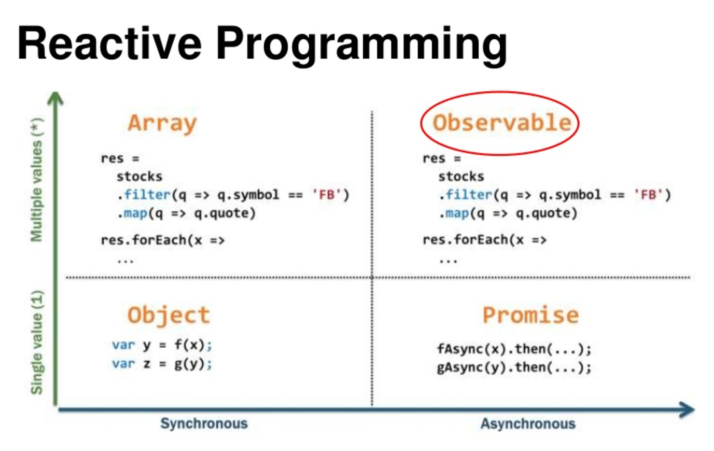
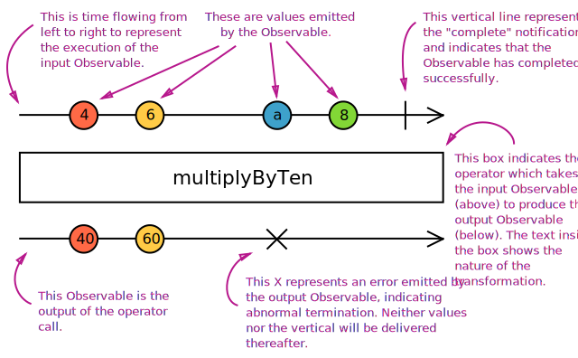

# Javascript - RxJS
<br>
> Everything is a event

<small>by Peter Cosemans</small>

<small>
Copyright (c) 2017 Euricom nv.
</small>

<style type="text/css">
.reveal pre code {
    display: block;
    padding: 5px;
    overflow: auto;
    max-height: 800px;
    word-wrap: normal;
}
</style>

---

# Intro
> What the hell is RxJS

----

## ReactiveX

ReactiveX is an API for asynchronous programming with observable streams.

<br>
http://reactivex.io/

## RxJS

RxJS stands for Reactive Extensions for Javascript, and its an implementation of Observables for Javascript.

----

## Language Implementations

- ***JavaScript: RxJS***
- Java: RxJava
- C#: Rx.NET
- C#(Unity): UniRx
- Scala: RxScala
- Clojure: RxClojure
- C++: RxCpp
- Lua: RxLua
- Ruby: Rx.rb
- Python: RxPY
- Groovy: RxGroovy
- JRuby: RxJRuby
- Kotlin: RxKotlin
- Swift: RxSwift
- PHP: RxPHP
- Elixir: reaxive

----

## Reactive Programming

Is programming with asynchronous stream like:

    + mouse clicks
    + button events
    + keyboard
    + other events

    Events: [1,...,2,3,...,4,5,...,6]

But also

    + arrays
    + single value
    + error(s)
    + nothing (empty stream)

    Collection: [1, 2, 3, 4, 5, 6]

----

## Arrays and Events are collections/stream

</img>

Arrays are a collections of values.<br>
Events are fundamentally a collection of things, happens over time.

----

# Everything can be defined as a stream

And so be observed as a stream.

----

## RxJS4 vs RxJS 5

RxJS 5 is a ground-up rewrite of RxJS that actually began development when RxJS was in 2.0. This new version of RxJS had three basic goals:

- Better performance
- Better debugging
- Compliance with the ES7 Observable Spec

[https://github.com/ReactiveX/rxjs/blob/master/MIGRATION.md](https://github.com/ReactiveX/rxjs/blob/master/MIGRATION.md)

---

## Quickstart

> Your first observables

----

## NodeJS

Install RxJS

```bash
# install RxJS
$ yarn add rxjs
```

Create an observable stream

```js
// main.ts
import { Observable } from 'rxjs'

const array = [1, 2, 3, 4, 5];
const stream$ = Observable.from(array);
```

And subscribe to it

```js
stream$.subscribe((num) => {
    console.log(num)
})
```

----

## Browser

index.html

```html
<!DOCTYPE html>
<html lang="en">
<head>
    <meta charset="UTF-8">
    <title>Document</title>
</head>
<body>
    <h1>RxJS</h1>
    <button id="btn">Click me</button>
    <script src="https://cdnjs.cloudflare.com/ajax/libs/rxjs/5.0.1/Rx.js">
    </script>
    <script src="app.js"></script>
</body>
</html>
```

Observable from event

```js
const btn = document.querySelector('#btn')
const btnStream$ = Rx.Observable.fromEvent(btn, 'click')
```

And subscribe to it

```js
// simple
btnStream$.subscribe((event) => {
    console.log('Clicked', event)
})
```

----

## Subscribe

```js
// with success, error and completed
btnStream$.subscribe(
    // first function: success
    event => {
        console.log('Clicked', event)
    },
    // second function: error
    err => {
        console.log('Err', err)
    },
    // third function: completed
    completed => {
        console.log('Completed')
    }
)
```

Object syntax

```js
btnStream$.subscribe({
    next: event => {
        console.log('Clicked', e)
    },
    completed: () => {
        console.log('|')
    }
    error: err = {
        console.log('Error', err)
    }
})
```

----



----

## Promise vs Observable

Promise

```js
const promise = service.doAction()
const otherPromise = promise
    .then(result => {
        console.log(result)
    })

// a promise execution returns back a promise.
```

vs Observable

```js
const observable$ = service.doAction()
const subscription = observable$
    .subscribe(result => {
        console.log(result)
    })

// a observable subscription returns a subscription
```

unsubscribe the subscription

```js
subscription.unsubscribe()
```


---

# Creating an observable
> You can create an observable from almost anything

----

## from Event

Button click

```js
const btn = document.querySelector('#btn')
const btnStream$ = Rx.Observable.fromEvent(btn, 'click')
```

Input change

```html
<input type="text" id="input"></input>
```

```js
const input = document.querySelector('#input')
const inputStream$ = Rx.Observable.fromEvent(input, 'keyup')
inputStream$.subscribe((event) => {
    console.log(event.target.value)
})
```

----

## from Arrays

Create an observable from an iterator

```js
const numbers = [1, 2, 3, 4, 5]
const numbers$ = Rx.Observable.from(numbers)
numbers$.subscribe(
    next: num => {
        console.log(num)
    },
    completed: () => {
        console.log('|')
    }
)
```

An finite Observable completes at the end of the stream

----

## Rx.Observable.from...

```js
// from array (iterable)
const source = Rx.Observable.from([1,2,3,4,5])
const source = Rx.Observable.from('hello from RxJS')

// from event
const input = document.querySelector('#input')
const source = Rx.Observable.fromEvent(input, 'click')

// from callback
const source = Rx.Observable.fromCallback(callback)

// from promise
const source = Rx.Observable.fromPromise(promise)

// from single value
const source = Rx.Observable.of('I am an observable')

// from multiple values
const source = Rx.Observable.range(1, 20)
const source = Rx.Observable.interval(1000)
const source = Rx.Observable.timer(5000, 1000)

// emits an error
const source = Rx.Observable.throw(new Error('haha'))

```

More: [reactivex.io](http://reactivex.io/rxjs/class/es6/Observable.js~Observable.html)

----

## Observable Timers

Infinite Timers

```js
// event every second
const source$ = Rx.Observable.interval(1000)
source$.subscribe(x => {
    console.log(x)
})
```

```js
// wait 5 sec, then event every second
const source$ = Rx.Observable.timer(5000, 1000)
source$.subscribe(x => {
    console.log(x)
})
```

An infinite Observable never completes

----

## Create your own observable

```js
const source$ = Rx.Observable.create(observer => {
    observer.next(1)
    observer.next(2)
    observer.next(3)
    observer.complete()
})

source$.subscribe(
    next: x => {
        console.log(x)
    },
    complete: () => {
        console.log('|')
    }
)
```

More practical

```js
const source$ = createFrom(array) {
    return Rx.Observable.create(observer => {
        for(const item of array) {
            observer.next(item)
        }
        observer.complete()
    })
}
```

----

## Create your own - timer

```js
const source$ = Rx.Observable.create(observer => {
    let i = 0;
    setInterval(() => {
        observer.next(i++)
    }, 1000)
})

source$.subscribe(x => {
    console.log(x)
})
```

```js
const source$ = Rx.Observable.create(observer => {
    let i = 0;
    const token = setInterval(() => {
        observer.next(i++)
    }, 1000)
    return () => {
        // Any cleanup logic might go here
        clearInterval(token)
    }
})

const subscription = source$.subscribe(x => {
    console.log(x)
})

setTimeout(() => {
    // stop timer
    subscription.unsubscribe();
}, 5000)
```

----

## Error in stream

```js
Rx.Observable.create(observer => {
    setTimeout(() => {
        observer.next('a value')
        observer.error(new Error('bad bad bad'))
        observer.next('yet another')
        observer.complete()
    }, 2000)
})
```

```js
source$
    .catch(err => Rx.Observable.of(err))
    .subscribe(
        x => {
            console.log(x)
        },
        err => {
            console.log(err)
        },
        complete => {
            console.log('|')
        }
    )
```

> Mark we don't have a completed now.

An settled stream is completed of failed.

---

## Operators
> To transform the observables

----

## Take operator

Take number of events

```js
Rx.Observable
    .interval(1000)
    .take(5)
    .subscribe(x => {
        console.log(x)
    })
```

----

## Map operator

Map value to something else

```js
const source$ = Rx.Observable
    .interval(1000)
    .map(x => x * 2)

source$.subscribe(x => {
    console.log(x)
})
```

----

## RX Marbles Diagrams



Samples
- [Map](http://rxmarbles.com/#map)
- [Take](http://rxmarbles.com/#take)

----

## Other operators

### Error handling

```js
source$
    .catch(err => Rx.Observable.of(err))  // Change err to success
    .subscribe(
        ...
    )
```

[Learn](https://www.learnrxjs.io/operators/error_handling/catch.html)

### Retry

```js
Rx.DOM.ajax('api/users')
    .retry(2)  // retry on error
    .subscribe(
        ...
    )
```

Observables are lyze by default.

[Learn](https://www.learnrxjs.io/operators/error_handling/retry.html)

----

## Filter operators

### filter

```js
const source$ = Rx.Observable.from([1,2,3,4,5]);
source$.filter(num => num % 2 === 0)
    .subscribe((val) => {
        console.log(`Even number: ${val}`)
    });
```

[Learn](https://www.learnrxjs.io/operators/filtering/filter.html) -
[Marbles](http://rxmarbles.com/#filter)

### takeUntil

```js
const clickStream$ = Rx.Observable.fromEvent(document, 'click').take(1);
const source$ = Rx.Observable.timeout(3000);
source$.takeUntil(clickStream$)
    .subscribe((event) => {
        console.log('i', event)
    })
```

The stream completes when the document is clicked.

[Learn](https://www.learnrxjs.io/operators/filtering/takeuntil.html) -
[Marbles](http://rxmarbles.com/#takeUntil)

----

## Transformation operators

----

## Map operator

Map value to something else

```js
const source$ = Rx.Observable
    .interval(1000)
    .map(x => x * 2)

source$.subscribe(x => {
    console.log(x)
})
```

## MapTo operator

Map to constant value

```js
Rx.Observable.interval(2000)
    .mapTo('HELLO WORLD!')
    .subscribe(x => {
        console.log(x)
    })
```

----

## Scan & Reduce operator

reduce operator

```js
// to define
Rx.Observable.from([1, 2, 3, 4, 5])
    .reduce((acc, val) => {
        return acc + val;
    }, 0)
    .subscribe(x => {
        console.log(x)
    })
```

The reduces waits until the stream is completed! <br>
Use ```scan``` if you have an infinite stream or want the result on each event

```js
// to define
Rx.Observable.interval(1000)
    .scan(0, (acc, val) => {
        return acc + val;
    })
    .subscribe(x => {
        console.log(x)
    })
```

[Learn](https://www.learnrxjs.io/operators/transformation/scan.html)
[Marbles](http://rxmarbles.com/#scan)

----

## Utility Operators

Logging ([do](https://www.learnrxjs.io/operators/utility/do.html))

```js
Rx.Observable
    .interval(1000)
    .do(x = > console.log(x))
    .subscribe(x => {
        console.log(x)
    })
```

## Observable to promise

```js
// Angular http returns an observable
http.get('api/users')
    .map(res => res.json())
    .toPromise()
    .then(user => {
        // result as an promise
        console.log(users)
    })
```

----

## More Operators

```js
    const stream = Rx.Observable
        .take(5)
        .skip(5)
        .filter(val => val > 2)
        .map(val => val + 1)
        // log current value of the stream
        .do(val => console.log(val))
        // retry: retry on error
        .retry(3)
        // error, wait for 0.5 sec and retry
        .retryWhen(error => error.delay(500))
        .timeout(2000)
        .timeout(2000, new Error('timeout exceeded'))
        // no duplicated values
        .distinctUntilChanges()
```

----

## Operators

#### Filter operators:
skip, take, takeUntil, filter, find, first, distinct, debounceTime, ...

#### Transform operators:
pluck, map, mapTo, ...

#### Mathematical operators:
count, sum, min, max, reduce, scan, ...

See [RxJS 5 Operators By Example](https://github.com/btroncone/learn-rxjs/blob/master/operators/README.md)

See [RxJS 5 Operators](https://github.com/Reactive-Extensions/RxJS/tree/master/doc/api/core/operators)

---

# Exercises

Basic RXJS handling

---

# Custom operator

```js
const a$ = Rx.Observable.interval(1000).take(5);

a$.subscribe({
    next: x => console.log(x),
    complete: () => console.log('|'),
})
```

Create a transform function

```js
function transform(input, fn) {
    return Rx.Observable.create(observer => {
        input.subscribe({
            next: v => observer.next(fn(v)),
            complate: () => observer.complete()
        });
    })
}
const b$ = transform(a$, x => x * 2)
b$.subscribe({
    next: x => console.log(x),
    complete: () => console.log('|'),
})
```

----

# Custom operator - prototype

Improve with prototype

```js
function transform(fn) {
    const input = this;
    return Rx.Observable.create(observer => {
        input.subscribe({
            next: v => observer.next(fn(v)),
            complate: () => observer.complete()
        });
    })
}

Rx.Observer.prototype.transform = transform;
```

```js
a$.transform(x => x * 2)
  .subscribe({
    next: x => console.log(x),
    complete: () => console.log('|'),
})
```

---

# Combine observables
> Wait for all, in parallel or transform

----

## merge

Combine to one stream

```js
Rx.Observable.of('hello')
    .merge(Rx.Observable.of('Everyone'))
    .subscribe(x => console.log(x))
```

```js
const source1$ = Rx.Observable.interval(2000).map(x => x + 1000)
const source2$ = Rx.Observable.interval(500).map(x => x)

Rx.Observable.merge(source1$, source2$)
    .take(25)
    .subscribe(x => console.log(x))
```

Also

```js
const first$ = Rx.Observable.interval(2500);
const second$ = Rx.Observable.interval(1000);
const example$ = first$.merge(second$);
const subscribe = example$.subscribe(val => console.log(val));
```

[Marbles](http://rxmarbles.com/#merge) -
[Learn](https://www.learnrxjs.io/operators/combination/merge.html)

----

## concat

One after the other

```js
const source1$ = Rx.Observable.range(0 /* start */, 5 /* count */)
const source2$ = Rx.Observable.range(7, 10)
Rx.Observable.concat(source1$, source2$)
    .subscribe(x => console.log(x))
```

[Marbles](http://rxmarbles.com/#concat) -
[Learn](https://www.learnrxjs.io/operators/combination/concat.html)

----

## forkJoin

Like Promise.all (wait until all is finished)

```js
const character$ = this.http.get('api/people/1').map(res => res.json())
const characterHomeworld$ = this.http.get('api/planets/1').map(res => res.json())

Rx.Observable.forkJoin([character$, characterHomeworld$])
    .subscribe(results => {
        console.log('homeworld' ,results[1])
        console.log('character', results[0])
    })
```

[Learn](https://www.learnrxjs.io/operators/combination/forkjoin.html)

----

## CombineLatest & Zip

CombineLatest: Use latest value of each stream<br>
Zip : Respond only to changes in both streams

```html
<select id="endpoint">
  <option value="users">Users</option>
  <option value="posts">Posts</option>
</select>

<select id="id">
  <option value="1">1</option>
  <option value="2">2</option>
</select>
```

```js
const endpointSelect = document.getElementById('endpoint');
const endpointStream$ = Rx.Observable.fromEvent(endpointSelect, 'change')
    .map(event => event.target)
    .map(target => (target.options[target.selectedIndex].text.toLowerCase()));

const idSelect = document.getElementById('id');
const idStream$ = Rx.Observable.fromEvent(idSelect, 'change')
    .map(event => event.target)
    .map(target => (target.options[target.selectedIndex].text));

endpointStream$.combineLatest(idStream$)
  .subscribe((event) => {
      console.log('combined', event)
  })
```

[Marbles](http://rxmarbles.com/#combineLatest) -
[Learn](https://www.learnrxjs.io/operators/combination/combinelatest.html)

----

## mergeMap (flatMap)

Use value of observable to be used on the second observable

```js
Rx.Observable.of('hello')
    .subscribe(x => {
        Rx.Observable.of(x + ' Everyone')
            .subscribe(y => {
                console.log(y)
            })
    })
```

Easier with mergeMap

```js
Rx.Observable.of('hello')
    .mergeMap(x => Rx.Observable.of(x + ' Everyone'))
    .subscribe(y => {
        console.log(y)
    })
```

Another sample

```js
// on button click log 5 intervals
Rx.Observable.fromEvent(btn, 'click')
    .mergeMap(x => Rx.Observable.interval(1000))
    .take(5)
    .subscribe(y => {
        console.log(y)
    })
```

[Marbles](http://reactivex.io/documentation/operators/flatmap.html) -
[Learn](https://www.learnrxjs.io/operators/transformation/mergemap.html)

----

## switchMap

Idem as flatMap but cancels the second when first emits

```js
Rx.Observable.fromEvent(document, 'click');
    // if another click comes within 3s, message will not be emitted
    .switchMap(val => Rx.Observable.interval(3000).mapTo('Hello, I made it!'))
    //(click)...3s...'Hello I made it!'...(click)...2s(click)...
    .subscribe(val => {
        console.log(val)
    })
```

[Learn](https://www.learnrxjs.io/operators/transformation/switchmap.html)

> Typical used with http.

---

# More to know
> What else do we have

----

## Subject

A Subject is both an Observable (so we can subscribe() to it) and an Observer (so we can call next() on it to emit a new value).

```js
var subject = new Rx.Subject()
subject.subscribe((v) => console.log('observerA: ' + v))
subject.subscribe((v) => console.log('observerB: ' + v))

subject.next(1)
subject.next(2)
subject.error(new Error('bad bad bad'))
```

So we can:

```js
const subject = new Rx.Subject()
button.addEventListener(‘click’, () => subject.next('click'))
subject.subscribe(x => console.log(x))
```

You also have:

- [ReplaySubject](https://github.com/Reactive-Extensions/RxJS/blob/master/doc/api/subjects/replaysubject.md): stores all the values that it has published
- [BehaviorSubject](https://github.com/Reactive-Extensions/RxJS/blob/master/doc/api/subjects/behaviorsubject.md): it only stored the last value it published
- [AsyncSubject](): like BehaviorSubject but only when execution completes.

----

## Hot vs Cold

The observable is said to be ***COLD*** because it does not generate new values if no subscriptions exist.

```js
const source$ = Rx.Observable.timer(1000)
    .do(() => console.log('***SIDE EFFECT***'))
    .mapTo('***RESULT***');
const subscribe = source$.subscribe(val => console.log(val));
const subscribeTwo = source$.subscribe(val => console.log(val));
```

Output

    ***SIDE EFFECT***
    ***RESULT***
    ***SIDE EFFECT***
    ***RESULT***

You can share a observable (makes a cold observable ***HOT***)

```js
const source$ = Rx.Observable.timer(1000)
    .do(() => console.log('***SIDE EFFECT***'))
    .mapTo('***RESULT***')
    .share();
const subscribe = source$.subscribe(val => console.log(val));
const subscribeTwo = source$.subscribe(val => console.log(val));
```

Output

    ***SIDE EFFECT***
    ***RESULT***
    ***RESULT***

---

## Resources

Try to understand

- [http://reactivex.io/rxjs/](http://reactivex.io/rxjs/)
- [Learn rxjs](https://github.com/btroncone/learn-rxjs)
- [List of tutorials and videos](http://reactivex.io/tutorials.html)
- [RxJs The Smartest Dumbest Tool Ever](http://www.christianalfoni.com/articles/2016_03_31_RxJs-the-smartest-dumbest-tool-ever)
- [Testing reactive code](https://glebbahmutov.com/blog/testing-reactive-code/)
- [RxJS Observables Crash Course](https://www.youtube.com/watch?v=ei7FsoXKPl0)
- [Avoiding Common Mistakes Using Rxjs](https://egghead.io/lessons/rxjs-convert-an-underlying-source-of-data-into-an-observable?series=save-time-avoiding-common-mistakes-using-rxjs)
